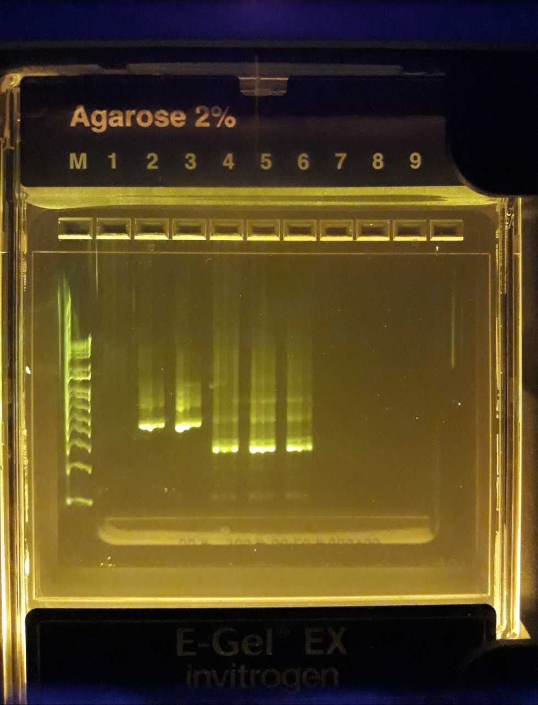
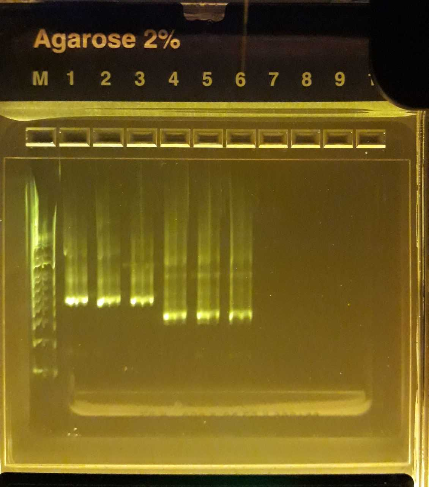

## Polyacrylamide bead formation

For each sample:

a) Combine the following reagents in a 2 ml round-bottom safe-lock microtube and vortex gently: 
- 120 µl sample material * 
- 80 µl 30% BIS/acrylamide (storage temp: 4 °C) 
- 25 µl 10% APS (storage temp: -20 °C)

(*) Samples:
- 1: Rhodomonas (concentrated by CellTrap to 2 ml, 600 000 cells/ml): 25 µl + 95 µl of H2O
- 2: Rhodomonas + wastewater (frozen): 25 µl + 95 µl, respectively
- 3: Wastewater: 120 µl
- 4: Rhdomonas (500 000 cells/ml), magnetically-selected beads: 25µl + 55 µl of H2O + 40 µl of Dynabeads MyOne Streptavidin C1 -suspension
- 5: Rhodomonas + wastewater (frozen), magnetically-selected beads: 25 µl + 55 µl (respectively) + 40 µl of Dynabeads MyOne Streptavidin C1 -suspension
- 6: Wastewater, magnetically-selected beads: 120 µl + 40 µl of Dynabeads MyOne Streptavidin C1 -suspension
- 7: Rhodomonas (430 000 cells/ml): 25 µl + 95 µl of H2O
- 8: Rhodomonas (430 000 cells/ml) + wastewater (frozen): 25 µl + 95 µl, respectively
- 9: Wastewater: 120 µl

b) Shake & mix STT (Span/Tween/Triton) emulsion oil thoroughly before use!  
Add 600 µl STT emulsion oil. (storage temp: RT) 
Vortex at max speed (3 000 rpm) for 30 s.

c) Add 25 µl TEMED.  (storage temp: RT) 
Vortex at max speed (3 000 rpm) for 30 s.

d) Allow tube to sit on the benchtop for polymerization to occur for 1h 30 min

e) Removal of oil:
- Equal volumes of water and diethyl ether (at least 50 % water!) mixed, shaken and opened occasionally to prevent pressure from building up.
- Add 800 µl of diethyl ether to the tube, then immediately close, invert and flick the tube to mix the emulsion with the ether. A visible precipitate ought to form. Draw off the ether/oil mixture around the precipitate and discard. The diethyl ether wash performed twice 
- Add 1 ml of autoclaved H2O to the top of the tube and mix by flicking and inverting. Centrifuge for 30 s at 12 000rcf. Three layers should form: a bottom layer of beads, a middle cloudy layer of oil/water, and a top milky layer of oil. Draw off the top oil layer as much as possible and discard.
- Repeat the H2O wash steps until there is no remaining oil at the top of the tube and the liquid phase is transparent.

f) Filtering through a 70µm filter

f) Samples 4-6: Additional magnetic selection and resuspension 

## Fusion PCR
Prepare the PCR master mix (done separately to samples 1-3, 4-6 and 7-9):
| Reagent | 1X | 4X (sets 1-3, 4-6) | 3.3X (7-9) |
| :---: | :---: | :---: | :---: |
| 5xGC buffer | 20 µl | 80 µl| 66 µl |
| 50 mM MgCl2 | 2 µl | 8 µl | 6.6 µl |
| dNTP mix (10 mM each) | 2.5 µl | 10 µl | 8.25 µl |
| 10 µM R2 and F1 primers (3, each) | 10 µl | 40 µl | 33 µl |
| 10 µM R1-F2’ and F2-R1' primers (4, each)  | 1 µl | 4 µl | 3.3 µl |
| 1e6 cp/µl (1e8 for 7-9) barcode | 1 µl | 4 µl | 3.3 µl |
| 100x mockmix * | - | - | 3.3 µl |
| Phusion DNA polymerase (2 U/µl) | 8 µl | 32 µl | 26.4 µl |

(*) Mockmix (100x)

- 18S mock 1 and 16S mock 1: 3e7 N/µl each
- 18S mock 2 and 16S mock 2: 3e6 N/µl each
- 16S-18S mock 4: 3e5 N/µl 

a)  Combine 33 µl of sample (bead suspension) and 67 µl of master mix. Add 100 µl of fluorinated oil with surfactant. 

b)  Place in shaker for 5 min and draw the emulsion through droplet splitter.

c)  Aliquot to two PCR tubes and cover with 50 µl of mineral oil. Chip washed with HFE7500 between samples.  

Running PCR:
| Step | Temperature (°C) | Time | Number of cycles |
| :---: | :---: | :---: | :---: |
| Beginning temperature | 80 | 10 s | 1 |
| Initial denaturation | 94 | 30 s | 1 |
| Denaturation | 94 | 5 s | 32 |
| Annealing | 55 | 30 s | 
| Extension | 72 | 30 s | 
| Final extension | 72 | 5 min | 1
| Storing temperature | 4 | Inf | 1

d) Pool the emulsion aliquots for each sample into a new safe-lock tube.

e) Separate the phases (top: mineral oil, middle: emulsion, bottom: surplus fluorinated oil) by spinning and discard the mineral oil. Some fluorinated oil may also be removed, if applicable.

f) Add 50 µl of PFO, mix and spin. The upper aqueous phase is collected / bottom phase discarded

g) Cleanup with Monarch® PCR & DNA Cleanup Kit (5 μg)

## 16S and 18S blocking

Prepare the PCR master mix (done separately to samples 1-3, 4-6 and 7-9):
| Reagent | 1X | 8X (sets 1-3, 4-6) | 13X (7-9) |
| :---: | :---: | :---: | :---: |
| PCR H2O | 7.25 µl | 94 µl | 94.25 µl |
| 5xGC buffer | 5 µl | 40 µl | 65 µl |
| dNTP mix (10 mM each) | 0.5 µl | 4 µl | 6.5 µl |
| 32 µM BlockF-16S and BlockR-16S primers (2, in 8x combined/ in 13x each) | 2.5 µl | 20 µl | 32.5 µl |
| 32 µM BlockF-18S and BlockR-18S primers (2, in 8x combined/ in 13x each) | 2.5 µl | 20 µl | 32.5 µl |
| Phusion DNA polymerase (2 U/µl) | 0.25 µl | 2 µl | 3.25 µl |

Samples 1-6: combined 45 µl mastermix and 5 µl template (purified fusion PCR product)
Samples 7-9: combined 23 µl mastermix and 2 µl template (purified fusion PCR product), 4 replicates for each sample

Running PCR:
| Step | Temperature (°C) | Time | Number of cycles |
| :---: | :---: | :---: | :---: |
| Beginning temperature | 98 | 30 s | 1 |
| Denaturation | 98 | 10 s | 30 |
| Annealing | 55 | 30 s | 
| Extension | 72 | 30 s | 
| Final extension | 72 | 5 min | 1 |
| Storing temperature | 4 | Inf | 1 |

Cleanup with Monarch® PCR & DNA Cleanup Kit (5 μg).

## Nested PCR 

Prepare 2 PCR master mixes (with either 16S and 18S nested primers), (done separately to samples 1-3, 4-6 and 7-9):
| Reagent | 1X | 4X (sets 1-3, 4-6) | 10X (7-9) |
| :---: | :---: | :---: | :---: |
| PCR H2O | 14.75 µl | 59 µl | 72.5 µl |
| 5xGC buffer | 5 µl | 20 µl | 50 µl |
| dNTP mix (10 mM each) | 0.5 µl | 2 µl | 5 µl |
| Primer mix * either 16S or 18S | 2.5 µl | 10 µl | 175 µl |
| Phusion DNA polymerase (2 U/µl) | 0.25 µl | 1 µl | 2.5 µl |

(*) Primer mixes: 
- 16S: 16S nested primers (3 primers), i5 forward, BlockF, BlockR; (3µM each) 
- 18S: 18S nested primers (3 primers), i5 forward, BlockF, BlockR; (3µM each)

Samples 1-6: combined 23 µl mastermix + 2 µl of sample (from blocking PCR), no replicates
Samples 7-9: combined 23 µl mastermix + 2 µl of sample (from blocking PCR), 4 replicates each sample

Running PCR:
| Step | Temperature (°C) | Time | Number of cycles |
| :---: | :---: | :---: | :---: |
| Beginning temperature | 98 | 30 s | 1 |
| Denaturation | 98 | 10 s | 24 |
| Annealing | 55 | 30 s | 
| Extension | 72 | 30 s | 
| Final extension | 72 | 5 min | 1
| Storing temperature | 4 | Inf | 1

Replicate samples pooled and cleanup with Monarch® PCR & DNA Cleanup Kit (5 μg).

Gel electrophoresis: 
Agarose gel casket: Invitrogen E-Gel® EX with SYBR® Gold II, 2% agarose, program: E-Gel EX 1–2% (10 mins)
The samples used in sequencing highlighted with bold.

<td valign="top"></td>

3. Magnetically selected, rhodomonas 16S
4. **16S Rhodo** 
5. **16S Rhodo + wastewater (ww)** 
6. **16S Wastewater** 
7. Magnetically selected, rhodomonas 18S 
8. **18S Rhodo** 
9. **18S Rhodo + wastewater** 
10. **18S Wastewater** 

<td valign="top"></td>

M. 1 kb marker 
1. 16S ww sample 
2. **16S rhodo mag** 
3. **16S rhodo+ww mag **
4. **16S ww mag** 
5. 18S ww sample 
6. **18S rhodo mag** 
7. **18S rhodo+ww mag** 
8. **18S ww mag** 

<td valign="top"></td>

M. 1 kb marker
1. 16S rhodo + mock
2. **16S rhodo + ww + mock**
3. **16S ww + mock**
4. **18S rhodo + mock**
5. **18S rhodo + ww + mock**
6. **18S ww + mock**

16S rhodo + mock sample replaced by another sample produced earlier with only two nested PCR replicates.

## Indexing

16S and 18S barcoding experiments were further prepared for sequencing using indexing primers.

Primers used:

| | S505 | S506 | S507 | S508 | S510 | S511 |
| :---: | :---: | :---: | :---: | :---: | :---: | :---: |
| **N701** | Sample 1, 16S | Sample 1, 18S | Sample 4, 16S | Sample 4, 18S | Sample 7, 16S | Sample 7, 18S |
| **N702** | Sample 2, 16S | Sample 2, 18S | Sample 5, 16S | Sample 7, 16S | Sample 8, 16S | Sample 8, 18S |
| **N703** | Sample 3, 16S | Sample 3, 18S | Sample 6, 16S | Sample 6, 18S | Sample 9, 16S | Sample 9, 18S |

 Prepare following PCR mix (Samples 1-6 and 7-9 prepared separately):

| Reagent | 1X | 50X (1-6) | 5X (7-9) |
| :---: | :---: | :---: | :---: |
| H2O | 12,4 µl | 620 µl | 62 µl |
| 5x HF buffer | 4 µl | 200 µl | 20 µl |
| dNTP mix (10 mM each) | 0,4 µl | 20 µl | 2 µl |
| Phusion DNA polymerase (2 U/µl) | 0,2 µl | 10 µl | 1 µl |
| i5 primer (10 µM) | 1 µl | - | 5 µl |
| i7 primer (10 µM) | 1 µl | - | 5 µl |

Samples 1-6: Pipette 17 µl of mastermix, 1 µl of appropriate primers each, and 1 µl template (purified nested PCR product) to 4 PCR tubes per sample.
Samples 7-9: Pipette 19 µl of mastermix and 1 µl template (purified nested PCR product) to 4 PCR tubes per sample.

b) Run the following cycling program:

| Step | Temperature (°C) | Time | Number of cycles |
| :---: | :---: | :---: | :---: |
| Beginning temperature | 98 | 30 s | 1 |
| Denaturation | 98 | 10 s | 12 |
| Annealing | 55 | 20 s | 
| Extension | 72 | 20 s | 
| Final extension | 72 | 5 min | 1
| Storing temperature | 4 | Inf | 1

Pool replicate samples, purify with Monarch® PCR & DNA Cleanup Kit (5 μg).

Agarose gel casket: Invitrogen E-Gel® EX with SYBR® Gold II, 2% agarose, program: E-Gel EX 1–2% (10 mins):

<td valign="top"></td>

M. 1 kb marker 
1. 16S rhodo
2. 16S rhodo + ww
3. 16S ww 
4. 16S rhodo (mag) 
5. 16S rhodo + ww (mag) 
6. 16S ww (mag) 

<td valign="top"></td>

M. 1 kb marker 
1. 18S rhodo
2. 18S rhodo + ww
3. 18S ww 
4. 18S rhodo (mag) 
5. 18S rhodo + ww (mag) 
6. 18S ww (mag)

<td valign="top"></td>

M. 1 kb marker 
1. 16S rhodo + mock
2. 16S rhodo + ww + mock
3. 16S ww + mock
4. 18S rhodo + mock
5. 18S rhodo + ww + mock
6. 18S ww + mock

## Sample pooling and sequencing

For the samples 1-6 (both 16S and 18S) further gel isolation was performed:
a) Cut the piece with correct DNA band. It weighs approximately 30 - 100 mg. Add 400 µl of dissolving buffer to 100 mg of agarose.

b) Melt the gel piece by placing the tube in 50 °C for about 10 min. Flip the tube a few times during incubation.

c) Load the solution to column and centrifuge as normal. 

The purified product DNA concentrations were measured by fluorometry (Qubit): 

| Sample | Target | Measurement (ng/ml) | Original (ng/µl) |
| :---: | :---: | :---: | :---: |
| 1 | 16S | 4.7 | 1.88 |
| 2 | 16S | 136 | 54.4 |
| 3 | 16S | 98.8 | 39.5 |
| 4 | 16S | 27 | 10.8 |
| 5 | 16S | 87.3 | 34.9 |
| 6 | 16S | 46.5 | 18.6 |
| 7 | 16S | 104 | 41.6 |
| 8 | 16S | 129 | 51.6 |
| 9 | 16S | 97 | 38.8 |
| 1 | 18S | 80.9 | 32.4 |
| 2 | 18S | 66.4 | 26.6 |
| 3 | 18S | 21.7 | 8.68 |
| 4 | 18S | 57.6 | 23 |
| 5 | 18S | 81.1 | 32.4 |
| 6 | 18S | 42.5 | 17 |
| 7 | 18S | 85.3 | 34.1 |
| 8 | 18S | 89.5 | 35.8 |
| 9 | 18S | 102 | 40.8 |

For the library, the volume of each sample added was such that the final concentration of each sample would be 0.2 ng/µl in 100µl. The final library concetration measured with Qubit was 1.38e3 ng/ml

The library was diluted to 4nM using elution buffer (Qiagen). 

Preparing the library for sequencing:

a) Prepare a Fresh Dilution of NaOH:  
- Combine the following volumes in a microcentrifuge tube: Laboratory-grade water (16 μl) + Stock 1.0 N NaOH (4 μl)  
- Invert the tube several times to mix.  

b) Prepare HT1  
- Remove HT1 from -25°C to -15°C storage and thaw at room temperature.  
- Store at 2°C to 8°C until you are ready to dilute denatured libraries.  

c) Denature a 4 nM Library :
- Combine the following volumes in a microcentrifuge tube: 4 nM library (5 μl) + 0.2N NaOH (5 μl)  
- Vortex briefly and then centrifuge at 280 × g for 1 minute.  
- Incubate at room temperature for 5 minutes.  

d) Add 990 μl prechilled HT1 to the tube containing denatured library. The result is 1 ml of a 20 pM denatured library.  

e) Dilute Denatured 20 pM Library: 
- Dilute to 6pM using the following volumes: 20 pM library (180 μl) + Prechilled HT1 (420 μl) 
- Invert to mix and then pulse centrifuge.  

The sample was loaded into the casette and the sequencing was performed in the Turku Bioscience facilities, using Illumina's MiSeq .

